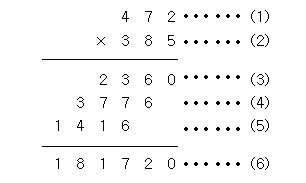

## 문제 정보

[👉 2588번: 곱셈](https://www.acmicpc.net/problem/2588)

## 문제 정의
<details><summary> 문제
</summary>

#### (세 자리 수)x(세 자리 수)는 다음과 같은 과정을 통하여 이루어진다.

#### (1)과 (2)위치에 들어갈 세 자리 자연수가 주어질 때 (3), (4), (5), (6)위치에 들어갈 값을 구하는 프로그램을 작성하시오.
</details>

`input` 첫째 줄에 (1)의 위치에 들어갈 세 자리 자연수가, 둘째 줄에 (2)의 위치에 들어갈 세자리 자연수가 주어진다. <br>
- 472
- 385

`output` 첫째 줄부터 넷째 줄까지 차례대로 (3), (4), (5), (6)에 들어갈 값을 출력한다. <br>
- 2360
- 3776
- 1416
- 181720

## 코드

```java
import java.util.ArrayList;
import java.util.Scanner;

public class Main {
    public static void main(String[] args) {
        Scanner sc = new Scanner(System.in);
        ArrayList<Integer> arrB = new ArrayList<>();

        int a = sc.nextInt();
        int b = sc.nextInt();
        int result = a * b;

        while (b > 0) {
            arrB.add(b % 10);
            b /= 10;
        }

        for (int i = 0; i < arrB.size(); i++) {
            System.out.println(a * arrB.get(i));
        }

        System.out.println(result);
    }
}
```

## 메모
정수형의 데이터를 자릿수로 나누어 ArrayList에 저장했는데 (6)을 출력하기 위해 변수를 하나 더 선언했다.
더 좋은 방법이 있는지 고민해 보자.